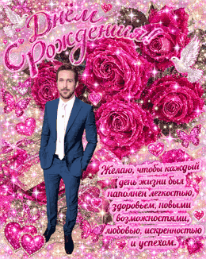
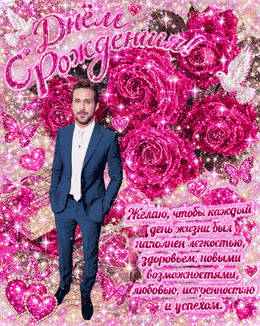
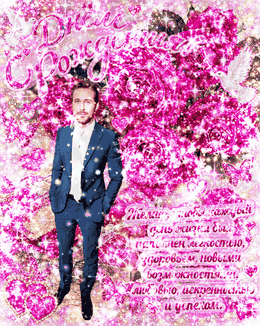

# glitter

Turns any picture into a gloriously tacky sparkling greeting card, the kind
that filled inboxes and MySpace profiles around 2008.

<!-- Two things this markup is working around, both about how GitHub renders.
     A Markdown table sizes each column to fit its header, so
     "maximum-overdrive" would come out wider than "y2k" and the images with
     it; hence an HTML table with a fixed img width. And GitHub wraps animated
     GIFs in its own player, which a static image does not get, so source.gif
     is a GIF too — the same card, no glitter, two identical frames. -->
<table>
<tr>
<td align="center"><br><sub>source</sub></td>
<td align="center"><br><sub><code>tasteful</code></sub></td>
<td align="center"><br><sub><code>default</code></sub></td>
<td align="center"><br><sub><code>y2k</code></sub></td>
<td align="center"><br><sub><code>maximum-overdrive</code></sub></td>
</tr>
</table>

The glitter is not scattered at random. It reads the picture: roses and
lettering get buried in sparkles, faces are left alone. No neural network is
involved — it is all numpy, and it runs in about twelve seconds for a
1120x1405 card with forty thousand particles.

## Install

```bash
git clone https://github.com/kantid/glitter.git
cd glitter
python3 -m venv .venv
source .venv/bin/activate
pip install -r requirements.txt
```

Or with [uv](https://docs.astral.sh/uv/):

```bash
uv venv && uv pip install -r requirements.txt
```

Requires Python 3.11 or newer (the TOML parser is in the standard library from
3.11 on).

## Quick start

```bash
# Always start here: one frame at quarter resolution, renders in a second.
python -m glitter.cli card.jpg --preview

# Happy with it? Render the whole loop.
python -m glitter.cli card.jpg
```

You get `card_glitter.gif` and `card_glitter.webp` next to the source.

## Examples

**Pick a look.** Four presets ship with the project:

```bash
python -m glitter.cli photo.jpg --preset tasteful
python -m glitter.cli photo.jpg --preset y2k
python -m glitter.cli photo.jpg --preset maximum-overdrive
python -m glitter.cli --list-presets
```

| preset | what it is |
|---|---|
| `tasteful` | fine dust, a few stars, one slow sweep, no flash |
| `default` | the reference, and the only fully documented one — start your own from it |
| `y2k` | [the authentic period recipe](#how-they-did-it-in-the-2000s): hard pixels, an outline, coarse twinkling |
| `maximum-overdrive` | everything at eleven, the reason this exists |

**See where the glitter will land before rendering.** This is the single most
useful flag when a result disappoints:

```bash
python -m glitter.cli photo.jpg --dump-density
```

It writes `photo_density.png`. White areas will sparkle, black areas will not.
If the wrong things are lit up, that tells you which `[density]` weight to turn.

**Keep something free of glitter.** The skin heuristic handles faces
automatically, but for anything else, paint a mask — white where you want it
left alone — and pass it in:

```bash
python -m glitter.cli photo.jpg --protect mask.png
```

**Get the same result twice.** Same seed, same sparkle layout:

```bash
python -m glitter.cli photo.jpg --seed 42
```

**Make it small enough to send.** Resolution and frame count are the levers:

```bash
python -m glitter.cli photo.jpg --gif-width 400 --frames 24 --gif-colors 32
```

**Render faster while experimenting.** Shrink the source first:

```bash
python -m glitter.cli huge.jpg --width 600
```

**Write your own preset.** Copy the documented reference and point at it:

```bash
cp glitter/presets/default.toml mine.toml
python -m glitter.cli photo.jpg --preset mine.toml
```

**Reproduce the table above.** The source card is in the repository, so every
GIF in this README can be regenerated exactly:

```bash
for p in tasteful default y2k maximum-overdrive; do
  python -m glitter.cli examples/source-card.png --preset "$p" \
      --width 420 --gif-width 260 --no-webp -o "examples/$p"
done
```

### All flags

| flag | what it does |
|------|--------------|
| `--preview` | one frame at quarter resolution; tuning is unbearable without it |
| `--preset NAME` | a preset name or a path to your own TOML |
| `--list-presets` | show the presets with their particle counts and frame counts |
| `--seed N` | reproducibility: same seed, same layout |
| `--width N` | resize the source before rendering — the main speed lever |
| `--protect mask.png` | exclusion mask: white means leave free of glitter |
| `--dump-density` | save the density map as a PNG |
| `--frames N` | cycle length in frames |
| `--fps N` | playback rate |
| `--gif-width N` | GIF width, default 560; `0` skips resizing |
| `--gif-colors N` | palette size, default 64 |
| `--no-delta` | disable GIF delta encoding (roughly twice the size) |
| `--webp-width N` | WebP width, default 900 |
| `--webp-quality N` | WebP quality, default 70 |
| `--no-gif` / `--no-webp` | skip one of the outputs |
| `--flash-extreme` | white strobe — [read the warning first](#a-warning-about-flashing) |

## Where the glitter lands

Positions are sampled from a density map assembled out of image features, all
in numpy:

```
density = luma^gamma + saturation + edges + text + sum(hue_bands) - protect
```

| goal | how it is achieved |
|---|---|
| roses buried in sparkles | hue band around magenta, times saturation |
| gold glinting | hue band around yellow, times brightness |
| white lettering shining | white top-hat: bright strokes thinner than the structuring element |
| background sparkling less | percentile normalisation clips the bottom of the distribution |
| faces left alone | HSV skin heuristic, or better, your own `--protect` mask |

The weights live in the `[density]` section of a preset. Tuning them blind is
pointless, which is what `--dump-density` is for.

The skin heuristic is exactly that — a heuristic, not a face detector. It will
catch any skin and some warm beige surfaces along with it. When you need
precision, draw a mask.

## What the glitter is made of

Sprites: `dot`, `speck`, `star4`, `star6`, `star8` (the last with alternating
long and short rays). Every size is pre-rendered at eight rotation angles;
nothing is rotated or scaled at render time.

Sprites are computed with supersampling — on a grid four times finer, averaged
down. Without it a three-pixel dot looks like a diamond, and it cannot look
like anything else: you cannot draw a circle on nine pixels.

Each particle system has a `density_gamma`, the exponent it raises the shared
density map to before sampling. Above 1 the system crowds into the brightest
places (that is how the large stars land); below 1 it spreads out, which is how
big dots are kept off the thin strokes of lettering.

If the result is blinding, the first knob is not the systems' `gain` but
`sweep_glitter_gain`: sweeps multiply the glitter beneath them and contribute
more to clipping than anything else.

## Sweeps, pulsing, flash

`[[sweep]]` sections define bands of light travelling across the card. Glitter
under a sweep flares harder than the picture itself (`sweep_glitter_gain`
versus `sweep_base_gain`) — otherwise it is not a beam, just an exposure bump.

`passes` is passes per cycle and must be an integer, or the loop tears at the
seam. Keep `width` narrow: gaussian tails on wide bands add up into a constant
wash that drains the colour out of the card.

`[grade]` holds the amplitudes for saturation, contrast and hue pulsing. Their
phases are spread a third of a period apart internally — in lockstep they read
as one shared brightness pulse. `[flash]` is one flash per cycle, gentle by
default: a 1.35x brightness lift over three frames, no white.

Highlights are rolled off by a soft knee (`highlight_knee`, default 205):
identity below the threshold, asymptotic to 255 above it. Without it, additive
glitter drove 14% of the frame to pure white, and what was lost there was not
excess brightness but colour.

`headroom` (default 0.7) dims a speck according to how bright the spot it
landed on already is — white cannot be made whiter. Without it, on smooth
bright pictures glitter becomes the only detail and erases the structure;
on pastel sources a third of it went missing.

## How they did it in the 2000s

Working out why soft round dots looked wrong led back to the original
technique. These cards were assembled in Paint Shop Pro and Jasc Animation
Shop, and the mechanics were nothing like "scatter some sprites":

- **Glitter was a fill, not particles.** A seamless tile of dense colour noise
  was flood-filled into a selection — text, petals, an object.
- **There were three frames.** Three tiles, cycled at 5 to 9 frames per second.
  The shimmer came from swapping the entire noise field at once, hence the
  characteristic jitter.
- **No antialiasing at all.** Indexed palette: a pixel is either fully lit or
  not. There were no midtones to be had.
- **The outline.** Glitter-text tutorials repeat this verbatim:
  `Selections > Expand` by one pixel, "it looks best when you have a border".
  What sparkles is a filled region with a hard bright edge, not the scattered
  dots on their own.

The `y2k` preset reproduces that recipe: the `speck` sprite, a `[contour]`
section, `phase_slots = 3` with high harmonics, and `highlight_knee = 245`.

Sources: [Aesthetics Wiki: Glitter Graphics](https://aesthetics.fandom.com/wiki/Glitter_Graphics),
[Glitter Animation Tutorial (LiveJournal)](https://icon-tutorial.livejournal.com/4040753.html),
[Glitter Text Tutorial (AnotherJo)](http://psp.anotherjo.com/glitter_text.htm),
[Seamless Glitter Tile Tutorial (Humbug Graphics Galore)](http://humbuggraphicsgalore.blogspot.com/2009/01/seamless-glitter-tile-tutorial.html),
[Glittery Text (CreateBlog)](https://www.createblog.com/paintshop-pro-tutorials/11-glittery-text/).

## Why it is fast

Real glitter is glued to the surface: it does not move, it twinkles. So the
particles are never redrawn. They are scattered across phase buckets, the
layers are rendered once, and a frame is a weighted sum:

```
frame(t) = base + sum_k w_k(t) * layer_k
```

Twenty array multiplications per frame instead of forty thousand draw calls.

Sweeps are evaluated through a one-dimensional lookup table, since a sweep's
brightness depends only on the pixel's projection onto a single axis. The
colour grade and the flash fold into one 3x3 matrix, because all of them are
linear.

## File sizes

Glitter is maximum-entropy noise and nothing compresses it. The levers are
resolution and frame count, not the format.

Measured on a 1120x1405 card, 48 frames, 38,000 particles:

| | 480px | 640px |
|---|---|---|
| GIF, 64 colours, no delta | 10.6 MB | 17.7 MB |
| GIF, 64 colours, with delta | **5.0 MB** | **8.3 MB** |

Delta encoding is on by default and disabled with `--no-delta`. It saves about
half and is completely lossless: roughly 72% of pixels match between adjacent
frames, and those are marked with a transparent index.

Contrary to popular belief, **animated WebP is not smaller than GIF here** —
its compression does poorly on high-frequency noise. Its only advantage is
colour fidelity, since it has no 64-colour palette to squeeze into.

## About other people's pictures

A card made from someone else's photograph is still someone else's photograph.
Celebrities and other people's faces are your problem to sort out; the tool
knows nothing about rights. The sample cards in this repository are period
artefacts found online and are here for illustration only.

## Licence

MIT — see [LICENSE](LICENSE). This covers the code. It does not cover the
sample images, which are not ours to license.

## A warning about flashing

`--flash-extreme` enables a full-frame white strobe. **Flashing is dangerous
for people with photosensitive epilepsy.** It is off by default, and turning it
on for a card you are sending to a real person is a bad idea — the 2008 effect
comes across perfectly well with the gentle brightness lift.

## Design notes

[PLAN.md](PLAN.md) documents every architectural decision, the measurements
behind them, and the places where the original plan turned out to be wrong.
